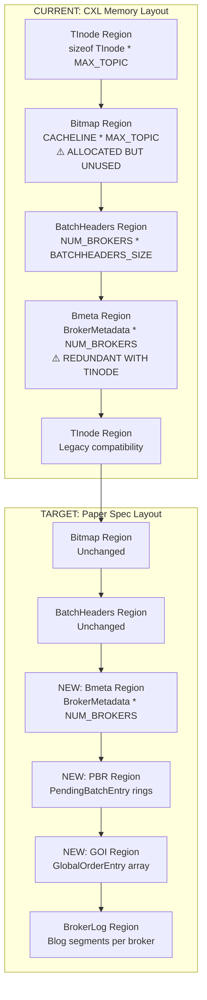
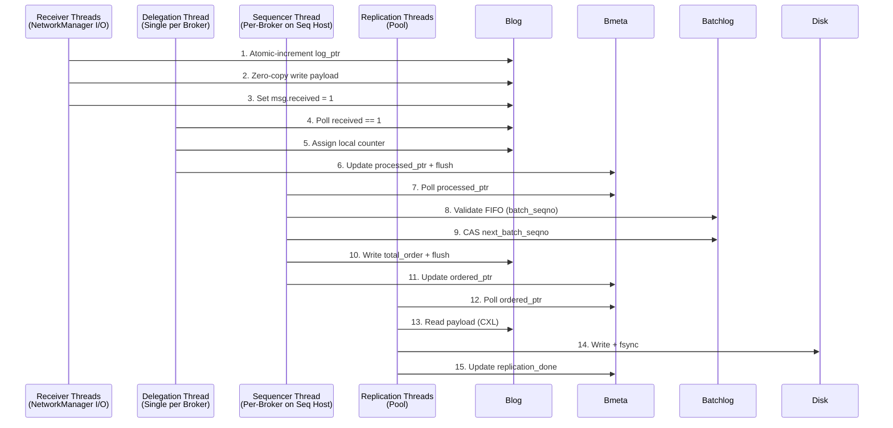

# System Patterns: Migration Map

**Document Purpose:** Migration roadmap from current implementation to NSDI '26 Paper Specification
**Status:** Gap Analysis Complete | Phase 1 Complete | Phase 2 In Progress
**Last Updated:** 2026-01-25

---

## Executive Summary

This document maps the gap between the **Current Codebase** and the **Target Architecture** specified in the NSDI '26 paper. It serves as the canonical reference for understanding:

1. **What we have** (current implementation patterns)
2. **What we need** (paper specification requirements)
3. **What's missing** (concrete primitives, structures, protocols)
4. **How to migrate** (phased approach with fallback strategies)

**Critical Insight:** The codebase contains a working system with excellent performance characteristics, but uses a pre-paper architecture (`TInode`-based) that predates the disaggregated memory design. Migration must be incremental and backward-compatible.

---

## 1. Memory Layout: TInode → Bmeta/Blog/Batchlog

### Current State (src/cxl_manager/cxl_datastructure.h:28696-28812)

```cpp
// CURRENT: Monolithic metadata structure
struct alignas(64) offset_entry {
    volatile size_t log_offset;              // Mixed ownership
    volatile size_t batch_headers_offset;    // Mixed ownership
    volatile size_t written;                 // Broker writes
    volatile unsigned long long written_addr;// Broker writes
    volatile int replication_done[NUM_MAX_BROKERS]; // Replication writes
    // --- SEPARATE CACHE LINE ---
    volatile int ordered;                    // Sequencer writes
    volatile size_t ordered_offset;          // Sequencer writes
};

struct alignas(64) TInode {
    char topic[TOPIC_NAME_SIZE];
    volatile bool replicate_tinode;
    volatile int order;
    volatile int32_t replication_factor;
    volatile int32_t ack_level;
    SequencerType seq_type;
    volatile offset_entry offsets[NUM_MAX_BROKERS];
};
```

**Issues:**
- ⚠️ **ARCHITECTURAL DECISION NEEDED:** `offset_entry` has two cache-line-aligned structs, but they're in the same structure. Need to evaluate if this causes false sharing on real CXL hardware.
- ⚠️ **REDUNDANCY:** Separate `BrokerMetadata` (Bmeta) was created, but `TInode` serves the same purpose. Should refactor `TInode` instead of maintaining both.
- ✗ Single `written` field instead of separate `processed_ptr` (delegation) and `log_ptr` (receiver)
- ⚠️ **SEGMENT ALLOCATION:** Current implementation uses per-broker contiguous allocation instead of bitmap, causing fragmentation (see Section 1.3)

### Target State (Paper Spec Table 5)

```cpp
// TARGET: Split Bmeta per Single Writer Principle

// Part 1: Local Struct (ONLY Owner Broker Writes)
struct alignas(64) BrokerLocalMeta {
    volatile uint64_t log_ptr;           // Pointer to start of Blog
    volatile uint64_t processed_ptr;     // Last locally-ordered message
    volatile uint32_t replication_done;  // Replication status counter
    uint8_t padding[40];                 // Pad to 64 bytes
};

// Part 2: Sequencer Struct (ONLY Sequencer Writes) - SEPARATE CACHE LINE
struct alignas(64) BrokerSequencerMeta {
    volatile uint64_t ordered_seq;       // Global seqno of last ordered msg
    volatile uint64_t ordered_ptr;       // Pointer to end of last ordered msg
    uint8_t padding[48];                 // Pad to 64 bytes
};

// Combined Bmeta (per broker)
struct BrokerMetadata {
    BrokerLocalMeta local;      // Cache line 0 (broker writes)
    BrokerSequencerMeta seq;    // Cache line 1 (sequencer writes)
};
```

### Migration Path

**⚠️ ARCHITECTURAL DECISION (2026-01-24):**
After code review, identified that:
1. **TInode IS Bmeta** - They serve the same purpose (per-broker metadata). Should rename TInode to Bmeta. Plan refactoring.
2. **Current approach is redundant** - Created separate `BrokerMetadata` region, but `TInode.offset_entry` already tracks the same information
3. **Better approach:** Refactor `TInode` structure to eliminate false sharing, rather than maintaining two separate structures

**Revised Migration Path:**
1. ✅ Keep `TInode` for backward compatibility (current)
2. ✅ Add new `PendingBatchEntry` and `GlobalOrderEntry` (already done)
3. ⚠️ **DECISION PENDING:** Refactor `TInode.offset_entry` to split broker/sequencer fields into separate cache lines
4. ⚠️ **DECISION PENDING:** Remove redundant `BrokerMetadata` region (consolidate into TInode)
5. ⏳ Evaluate if current `offset_entry` structure (two cache-line-aligned structs) is sufficient or needs refactoring
6. ⏳ Performance test on real CXL hardware to verify no false sharing

**Memory Layout Diagram:**



---

## 2. Concurrency Model: Missing Primitives

### Current State: Partial Fence Implementation

**Location:** src/embarlet/topic.cc:30897-30898
```cpp
// CURRENT: Generic memory barrier (insufficient for non-coherent CXL)
__atomic_thread_fence(__ATOMIC_ACQUIRE);
```

**Location:** src/cxl_manager/cxl_manager.cc (NO CACHE FLUSHES FOUND)

### Target State (Paper Spec Section 4)

**Missing Primitives:**

```cpp
// REQUIRED: Explicit cache line flush + store fence (x86-64)

// Writer Pattern (Delegation Thread, Sequencer)
void publish_to_cxl(MessageHeader* msg) {
    // 1. Write data
    msg->total_order = global_seq++;

    // 2. MISSING: Flush cache line to CXL
    _mm_clflushopt((void*)msg);  // ❌ NOT FOUND IN CODEBASE

    // 3. MISSING: Ensure flush completes before advancing pointer
    _mm_sfence();                 // ❌ NOT FOUND IN CODEBASE

    // 4. Update pointer (monotonic)
    bmeta->seq.ordered_ptr = (uint64_t)msg;
}

// Reader Pattern (Sequencer polling broker, Subscriber polling)
MessageHeader* poll_next_message(BrokerMetadata* bmeta) {
    volatile uint64_t ptr;
    do {
        // Busy-wait poll (NO mutex allowed in hot path)
        ptr = bmeta->local.processed_ptr;
        _mm_pause();  // ✅ FOUND: std::this_thread::yield() used, but _mm_pause() is better
    } while (ptr == last_read_ptr);

    return (MessageHeader*)ptr;
}
```

### Concurrency Rules (The "Laws")

| Rule | Paper Requirement | Current Implementation | Gap |
|------|------------------|----------------------|-----|
| **Single Writer** | Cache line written by ≤1 host | `offset_entry` has mixed ownership | ❌ Split required |
| **Monotonicity** | Pointers/counters only increase | ✅ Implemented (fetch_add) | ✅ Compliant |
| **Flush & Poll** | `clflushopt` + `sfence` on write | ✅ Implemented (DEV-002: Batch flush) | ✅ Compliant |
| **No Locks in Hot Path** | Atomic polling only | ✅ Sequencer4 uses atomics | ✅ Compliant |

### Migration: Adding Cache Coherence Protocol

**File to Modify:** `src/common/performance_utils.h` (create if missing)

```cpp
// NEW: Non-coherent CXL memory primitives

namespace Embarcadero {
namespace CXL {

// Force cache line flush to CXL memory
static inline void flush_cacheline(const void* addr) {
#ifdef __x86_64__
    _mm_clflushopt(addr);
#else
    __builtin___clear_cache((char*)addr, (char*)addr + 64);
#endif
}

// Store fence: Ensure all flushes complete
static inline void store_fence() {
#ifdef __x86_64__
    _mm_sfence();
#else
    __sync_synchronize();
#endif
}

// Load fence: Ensure fresh read from memory
static inline void load_fence() {
#ifdef __x86_64__
    _mm_lfence();
#else
    __sync_synchronize();
#endif
}

// CPU pause for spin loops
static inline void cpu_pause() {
#ifdef __x86_64__
    _mm_pause();
#else
    __asm__ __volatile__("yield");
#endif
}

} // namespace CXL
} // namespace Embarcadero
```

**Integration Points:**
1. src/embarlet/topic.cc:30859 - CombinerThread after writing `UpdateTInodeWritten()`
2. src/embarlet/topic.cc:31071 - BrokerScannerWorker after assigning total_order
3. src/cxl_manager/cxl_manager.cc:37529 - UpdateTinodeOrder after writing metadata

---

## 3. Processing Pipeline: Stage Separation

### Current State: Sequencer4 Analysis

**Location:** src/embarlet/topic.cc:30974-31128

**Current Flow:**
```
BrokerScannerWorker (per broker thread) {
    1. Poll BatchHeader.num_msg != 0
    2. Check FIFO via next_expected_batch_seq_[client_id]
    3. Assign global_seq_ (under mutex)
    4. Write total_order to batch messages
    5. Advance current_batch_header pointer
}
```

**Issues:**
- ✗ Combines Stage 3 (Global Ordering) with partial Stage 2 (Local Ordering check)
- ✗ Uses `global_seq_batch_seq_mu_` mutex (acceptable, but paper implies lock-free CAS)
- ✗ Reads `num_msg` directly instead of polling `Bmeta.processed_ptr`

### Target State (Paper Spec Section 3)



### Migration: Explicit Stage Separation

**Phase 2.1: Refactor Sequencer4**

1. **Enhance Receiver Stage** (currently in NetworkManager::ReqReceiveThread)
   - **DECISION (DEV-003):** Keep receiver logic in NetworkManager, discard separate ReceiverThreadPool class
   - Use `Bmeta.local.log_ptr` for batch-level atomic allocation (replaces Topic's mutex)
   - Maintain zero-copy `recv()` directly into CXL memory
   - Set `batch_complete` flag after batch receive (one flush per batch)

2. **Formalize Delegation Thread** (currently `CombinerThread`)
   - Rename to `DelegationThread` for clarity
   - Poll `received == 1` instead of `paddedSize != 0`
   - Update `Bmeta.local.processed_ptr` instead of `TInode.offsets[].written`
   - **Add missing flush:** `CXL::flush_cacheline(&msg_header); CXL::store_fence();`

3. **Refactor BrokerScannerWorker** (Sequencer Stage)
   - Poll `Bmeta.local.processed_ptr` instead of `BatchHeader.num_msg`
   - Replace mutex with CAS for `next_batch_seqno` update
   - **Add missing flush:** After writing `total_order`

4. **Add Explicit Replication Stage**
   - Currently mixed into `ScalogReplicationClient` and `CorfuReplicationClient`
   - Create `ReplicationThreadPool` that polls `Bmeta.seq.ordered_ptr`
   - Update `Bmeta.local.replication_done` counter (atomic increment)

---

## 4. Data Structures: Message Header Alignment

### Current State: MessageHeader

**Location:** src/cxl_manager/cxl_datastructure.h:28762-28775

```cpp
struct alignas(64) MessageHeader {
    volatile size_t paddedSize;               // Includes header+padding+message
    void* segment_header;                     // Pointer to segment metadata
    size_t logical_offset;                    // Broker-local sequence
    volatile unsigned long long next_msg_diff;// Relative offset to next message
    volatile size_t total_order;              // Global sequence (sequencer writes)
    size_t client_order;                      // Client's batch sequence
    size_t client_id;                         // Client identifier
    size_t size;                              // Payload size
};
```

**Issues:**
- ✗ Header is 64 bytes, but fields are not split by writer
- ✗ `paddedSize` written by Receiver, `total_order` written by Sequencer (false sharing potential)
- ✗ No explicit `received` flag (uses `paddedSize != 0` as proxy)

### Target State (Paper Spec Table 4)

```cpp
// Blog Message Header (cache-line aligned, 64 bytes)
struct alignas(64) BlogMessageHeader {
    // --- Receiver Writes (Stage 1-2) ---
    volatile uint32_t size;          // Payload size
    volatile uint64_t ts;            // Receipt timestamp
    volatile uint32_t received;      // 0→1 when write complete
    uint32_t _pad1;

    // --- Delegation Writes (Stage 2) ---
    volatile uint32_t counter;       // Local per-broker sequence
    uint32_t _pad2;

    // --- Sequencer Writes (Stage 3) ---
    volatile uint64_t total_order;   // Global sequence number

    // --- Read-only metadata ---
    uint64_t client_id;
    uint32_t batch_seq;
    uint32_t _pad3;

    uint8_t padding[12];             // Pad to 64 bytes
};

static_assert(sizeof(BlogMessageHeader) == 64, "Must be cache-line sized");
```

**Ownership Model:**
```
Cache Line Offset 0-15:   Receiver writes    (size, ts, received)
Cache Line Offset 16-31:  Delegation writes  (counter)
Cache Line Offset 32-47:  Sequencer writes   (total_order)
Cache Line Offset 48-63:  Read-only          (client_id, batch_seq)
```

### Migration: Header Version Coexistence

**Strategy:** Add version field to differentiate header formats during migration.

```cpp
// Transition header with version tag
struct alignas(64) MessageHeaderV2 {
    uint16_t version;  // 1 = legacy, 2 = paper spec
    uint16_t _pad;
    union {
        MessageHeader v1;      // Legacy format
        BlogMessageHeader v2;  // Paper spec format
    };
};
```

**Rollout:**
1. Receivers check version, write appropriate format
2. Sequencer reads version, handles both formats
3. After validation period, deprecate V1

---

## 5. Batch Processing: Batchlog Integration

### Current State: BatchHeader Usage

**Location:** src/cxl_manager/cxl_datastructure.h:28745-28763

```cpp
struct alignas(64) BatchHeader {
    size_t batch_seq;              // Client batch sequence
    size_t total_size;             // Total batch size
    size_t start_logical_offset;   // Starting offset
    uint32_t broker_id;
    uint32_t ordered;
    size_t batch_off_to_export;
    size_t total_order;
    size_t log_idx;                // Offset to payload
    uint32_t client_id;
    uint32_t num_msg;
    volatile uint32_t batch_complete; // Completion flag
};
```

**Usage in Sequencer4:**
- ✅ Polls `num_msg != 0` to detect new batch
- ✅ Validates FIFO via `next_expected_batch_seq_[client_id]`
- ✅ Assigns `global_seq_` range for batch
- ✗ Does NOT use separate Batchlog structure per paper

### Target State (Paper Spec Table 3)

**Batchlog Entry (per batch):**
```cpp
struct alignas(64) BatchlogEntry {
    uint64_t client_id;           // Client identifier
    uint64_t batch_seq;           // Client batch sequence number
    uint32_t num_messages;        // Message count in batch
    uint32_t _pad1;
    uint64_t blog_start_ptr;      // Pointer to first message in Blog
    uint64_t blog_end_ptr;        // Pointer to last message in Blog
    uint64_t total_order_start;   // First global seqno assigned
    uint64_t total_order_end;     // Last global seqno assigned
    uint8_t padding[16];          // Pad to 64 bytes
};
```

**Key Difference:**
- Paper spec: Batchlog is **read-only index** (pointers to Blog data)
- Current: BatchHeader is **mutable** (ordered flag, total_order written by sequencer)

### Migration: Treat BatchHeader as Batchlog

**No structural change needed** - Current `BatchHeader` can serve as Batchlog with semantic reinterpretation:

1. **Receiver Stage:** Writes `batch_seq`, `client_id`, `num_msg`, `log_idx`
2. **Delegation Stage:** Writes `batch_complete = 1` after all messages processed
3. **Sequencer Stage:** Reads Batchlog, writes `total_order` range to Blog messages
4. **Critical:** Sequencer must NOT write to BatchHeader (read-only after delegation)

**Action:** Audit sequencer code to ensure BatchHeader is read-only in Stage 3.

---

## 6. Failure Recovery: Missing Components

### Current State: Partial Implementation

**Heartbeat-Based Detection:**
- ✅ src/embarlet/heartbeat.cc - Broker registration/deregistration
- ✅ Sequencer can detect broker failures via heartbeat timeout

**Batch Deduplication:**
- ✅ src/embarlet/topic.cc:31032-31063 - `next_expected_batch_seq_` map handles out-of-order batches
- ✅ Duplicate batch sequences are rejected (topic.cc:31059-31063)

**Missing:**
- ❌ Sequencer recovery from CXL state
- ❌ Chain replication for Bmeta
- ❌ Client retry with batch_seq tracking

### Target State (Paper Spec Section 5)

| Failure Type | Paper Spec Recovery | Current Implementation | Gap |
|-------------|-------------------|----------------------|-----|
| **Client Crash** | Resend unACKed batches. Duplicates filtered via `next_batch_seqno` | ❌ Client doesn't persist unACKed batch IDs | Missing client-side retry logic |
| **Broker Crash** | Blog remains in CXL, sequencer continues | ✅ Heartbeat removes broker from rotation | ✅ Functional |
| **Sequencer Crash** | New sequencer reads `ordered_seq`, `next_batch_seqno` from CXL | ❌ State is in-memory (`next_expected_batch_seq_` map) | **CRITICAL GAP** |
| **CXL Metadata Loss** | Recover from chain-replicated Bmeta copy | ❌ No metadata replication | Missing |
| **CXL Data Loss** | Pause service, rebuild Blog from disk replicas | ⏳ Disk replication exists, rebuild not implemented | Partial |

### Migration: Sequencer Recovery Protocol

**Phase 3.1: Persist Sequencer State to CXL**

```cpp
// NEW: Sequencer checkpoint structure in CXL
struct alignas(64) SequencerCheckpoint {
    volatile uint64_t global_seq;              // Current global sequence
    volatile uint64_t epoch;                   // Sequencer epoch (increments on failover)
    volatile uint32_t num_clients;             // Size of client state map
    uint32_t _pad;

    // Client FIFO tracking (fixed-size array, hash client_id)
    struct ClientState {
        uint64_t client_id;
        uint64_t next_expected_batch_seq;
    } clients[MAX_CLIENTS];  // e.g., 1024 clients
};
```

**Recovery Algorithm:**
```cpp
void SequencerFailover(SequencerCheckpoint* ckpt) {
    // 1. Read checkpoint from CXL
    uint64_t recovered_seq = ckpt->global_seq;

    // 2. Rebuild client state map
    for (auto& client : ckpt->clients) {
        if (client.client_id != 0) {
            next_expected_batch_seq_[client.client_id] = client.next_expected_batch_seq;
        }
    }

    // 3. Increment epoch to signal new sequencer
    ckpt->epoch++;
    CXL::flush_cacheline(ckpt);
    CXL::store_fence();

    // 4. Resume sequencing from recovered_seq
    global_seq_ = recovered_seq;
}
```

**Checkpoint Frequency:** Write checkpoint every N batches (e.g., N=100) or every T milliseconds (e.g., T=10ms).

---

## 7. Implementation Priorities

### Phase 1: Foundation ✅ COMPLETE
- [x] Add PendingBatchEntry, GlobalOrderEntry structures
- [x] Add cache flush primitives (`clflushopt`, `sfence`, `lfence`) - ✅ Complete
- [x] **ARCHITECTURAL DECISION:** Removed redundant Bmeta region - using TInode.offset_entry (DEV-004) - ✅ Complete
- [x] Fix segment allocation to use bitmap (DEV-005) - ✅ Complete

### Phase 2: Pipeline Refactor ⏳ IN PROGRESS
- [x] ~~Extract ReceiverThreadPool~~ **DECISION: Keep receiver logic in NetworkManager (DEV-003)** - ✅ Complete
- [x] Add cache flushes to DelegationThread (Stage 2) - ✅ Complete (DEV-002: Batch flush optimization)
- [x] Rename CombinerThread to DelegationThread - ✅ Complete
- [ ] Refactor BrokerScannerWorker to poll Bmeta.processed_ptr (Stage 3)
- [ ] Add ReplicationThreadPool polling ordered_ptr (Stage 4)

### Phase 3: Fault Tolerance (Q2 2026)
- [ ] Persist SequencerCheckpoint to CXL
- [ ] Implement sequencer recovery protocol
- [ ] Add Bmeta chain replication
- [ ] Client-side batch retry logic

### Phase 4: Optimization (Q3 2026)
- [ ] Replace MessageHeader with BlogMessageHeader
- [ ] Remove TInode dependency
- [ ] Lock-free CAS for next_batch_seqno updates
- [ ] NUMA-aware thread pinning

---

## 8. Validation Criteria

### Property 3d: Strong Total Ordering

**Test Case 1: Basic Publisher Ordering**
```
Client A publishes m1, gets ACK
Client B publishes m2
Verify: No subscriber delivers m2 before m1
```

**Test Case 2: FIFO Publisher Ordering**
```
Client A publishes m1, then m2
Verify: No subscriber delivers m2 before m1
```

**Test Case 3: Weak Total Ordering**
```
Subscriber S1 delivers m1 before m2
Verify: All other subscribers deliver m1 before m2
```

**Implementation:** src/test/embarlet/message_ordering_test.cc

### Property 4a: Full Durability

**Test Case:**
```
Client publishes message m
Wait for ACK
Verify: m is replicated to f+1 brokers AND written to disk (fsync)
```

**Implementation:** Check `Bmeta.local.replication_done >= replication_factor`

---

## 9. Rollback Strategy

**Principle:** All changes must support graceful rollback to TInode-based system.

**Rollback Triggers:**
- Performance regression >10% on throughput benchmarks
- Ordering violation detected in validation tests
- Unrecoverable crash in new code path

**Rollback Procedure:**
1. Set feature flag `USE_LEGACY_TINODE = true` in configuration
2. Restart brokers (reads TInode instead of Bmeta)
3. Monitor for 24 hours
4. If stable, investigate root cause offline
5. If unstable, escalate to architecture review

**Feature Flag Locations:**
- src/embarlet/topic.cc (CombinerThread)
- src/cxl_manager/cxl_manager.cc (GetNewSegment)
- src/embarlet/topic.cc (BrokerScannerWorker)

---

## 10. Open Questions

1. **Bmeta Replication Strategy:** Should we use chain replication (as spec suggests) or quorum-based replication (easier to implement)?
2. **SequencerCheckpoint Frequency:** What is the acceptable recovery time (RTO) vs. checkpoint overhead trade-off?
3. **Client Retry Protocol:** Should clients buffer unACKed batches in memory or persist to local disk?
4. **Cache Flush Performance:** What is the measured overhead of `clflushopt` on the hot path? Can we batch flushes?

---

## References

- **Paper Spec:** docs/memory-bank/paper_spec.md
- **Product Context:** docs/memory-bank/productContext.md
- **Current Codebase Map:** docs/context/codebase_map.xml
- **Data Structures:** src/cxl_manager/cxl_datastructure.h
- **Sequencer Implementation:** src/embarlet/topic.cc (Sequencer4, Sequencer5)
- **CXL Manager:** src/cxl_manager/cxl_manager.cc

---

**Document Maintenance:**
- Update this document when phase milestones are completed
- Add migration logs to track actual vs. planned timelines
- Archive old "Current State" sections in git history when deprecated
