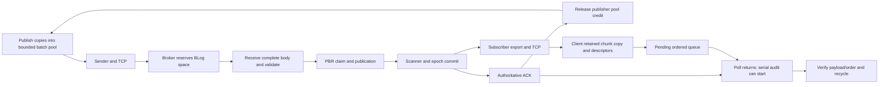

# Performance root-cause investigation — September 23, 2026

The largest newly activated cost is the audited client receive path: it allocates
and copies retained chunks during publishing, then defers consumption until ACK
completion. There are real added broker costs too, especially body validation
and authoritative session checks, but measured direct costs are much smaller.
The earlier roughly 8% difference between unpaired ACK-rate medians is not an
identified 8% broker regression. The fixed paired result remains inconclusive.

This investigation follows the actual baseline `ae9959dd` and measured source11
paths. Subsequent source14 routing rejection runs during client initialization
and was absent from the measured client; it cannot explain that comparison.
The source11 client was identical for both versions in the original comparison.
Its large absolute cost and audit-schedule sensitivity therefore do not, by
themselves, establish a broker-version treatment effect.

Production code and the original frozen binaries were not changed during this investigation. Diagnostic
binaries preserve safety checks and have separate source/build attestations. Subsequent implementation
and qualification are recorded in [Performance fixes](2026-09-23-performance-fixes.md).

The workload is one broker, ORDER5/ACK1/RF0, 2 GiB of 4096-byte indexed messages,
2 MiB batches, 64 GiB fresh DRAM emulation, 4 GiB segments, client CPUs 0–31/node 0,
broker CPUs 128–159/node 1. Physical CXL is absent. These results are bounded local
DRAM diagnostics, not sustainable server-capacity or CXL claims.

The actual dependency path is:

The producer warmup touches publisher buffers, not future subscriber chunk and
descriptor allocations. The new validation setting activates an existing owned
stream parser. Each receive chunk gets a retained vector copy; each message
gets a descriptor referring to that chunk. Fragmented carry messages can need
another copy. Until the serial audit starts, the parser cannot recycle those
objects through normal consumption. The 512 MiB publisher pool separately feeds
ACK timing back into producer progress.

Four initial fixed ABBA diagnostic runs passed exact 524288-message/2 GiB audits,
ACKs, zero retransmission/fence gates and normal owned cleanup. Both broker
versions used one identical instrumented source11 client. The candidate broker
also had scoped validation/commit/gate timers; existing commit profiling was
enabled for both. These diagnostic endpoints are not pooled with qualification.

| Measured candidate work, wall time over the whole 2 GiB run | First candidate | Second candidate |
|---|---:|---:|
| Ingress validation, 1041 batches/524288 messages |9.92 ms|10.58 ms|
| Complete commit including gate and nested timers |14.32 ms|13.94 ms|
| Session guard, included in commit |1.84 ms|1.87 ms|
| Publication-gate wait, included in commit |1.53 ms|1.50 ms|
| Subscriber retained-chunk copy wall time, through audit completion |1230.67 ms|1190.75 ms|
| ACK interval |1915.09 ms|1534.70 ms|
| Remaining audit interval after ACK |87.15 ms|613.84 ms|

The same candidate's faster ACK run had processed 392899 subscriber descriptors
at that endpoint, versus 517513 in its slower ACK run. About125000 messages and
287 ms of subscriber copy CPU work were shifted across the measurement boundary.
Meanwhile its measured broker validation/commit work barely changed. The ACK
rate rose 25% while audit-inclusive throughput fell about 7%. This documents different
amounts of receive work overlapping the producer/ACK interval; it does not alone
prove which thread caused the timing variation. The ACK endpoint includes a
complete client pipeline rather than measuring broker service time in isolation.

Across the earlier 24 retained one-broker measurements, ACK duration correlates
with whole-client system CPU (`r≈0.990`) and minor faults (`r≈0.915`). Those are
not causal proof: an earlier ACK also starts recycling sooner, which can itself
reduce later allocations/faults. The controlled audit-schedule experiment below
separately tests this feedback. Whole-lifetime counters cannot be substituted
for phase-local observations.

Across all eight diagnostics, main-thread Poll CPU was 412–564 ms against
414–566 ms wall time: approximately one fully occupied core while waiting.
This confirms active waiting, not how much it affects throughput.

The code review identified these additional inefficiencies and tradeoffs:

| Path | What changed or became active | Interpretation / remedy |
|---|---|---|
| Audited receiving | Timed retained chunk copies, descriptor allocation/pool locking and pending deque growth; full consumption deferred until Poll | Highest-priority measurement/client issue. Consume with exact verification concurrently and bound buffering; preserve serial mode as a separately named diagnostic. |
| Main-thread ACK wait | Recovery-safe deferred sender join exposes the existing busy ACK loop during sender drain, when the old client could block in join | New overlap of existing CPU work. Main-thread Poll CPU closely tracks its wall time. An adaptive event wait can preserve recovery workers without continuously polling. It needs a separate latency/correctness measurement. |
| Batch validation | Previously skipped on coherent DRAM; now every message header/stride is checked before publication | Necessary safety work; measured around 10 ms here. Optimize implementation only with malformed-body rejection intact. Small-message workloads need separate qualification. |
| Commit session guard | Always checks authoritative state; lookup refreshes a cache line and guard immediately refreshes it again | The second refresh is redundant under the supported local publication gate and stable-key contract. A diagnostic-only patch removes that duplicate while retaining fallback refresh and all guards. It has not been promoted to production. |
| Session publication | Existing-key lookup now invalidates and unconditionally flushes; monotonic maxima/state use CAS | Return a claimed/existing result to avoid unnecessary existing-key publication work; consider skipping unchanged state CAS. Preserve fencing and monotonic-prefix semantics. Costs are part of metadata/commit, not a separate proven bottleneck. |
| PBR refresh | Shared observer atomic flag and absolute unwrap/checks added; observer flag shares a cache line with producer state | Potential contention/false sharing with many producers. Separate line or conservative near-capacity refresh is a candidate optimization requiring proof and measurement. No multi-producer conclusion from this single-producer workload. |
| Module extraction | Some cross-file calls lose same-translation-unit inlining opportunities | Source-equivalent bodies do not prove identical generated code. This is an unquantified code-generation hypothesis, not an established cause. |

There are offsetting improvements: the candidate removes the baseline's
per-successful-BLog-reservation GC mutex, and consolidates commit counting with
checked single-writer range reservations. Request-queue cancellation, mapping
validation, startup configuration freeze and routing rejection are predominantly
cold/lifecycle work. Production fault hooks compile out. Scanner steady-state
logic, normal epoch scheduling and ACK frontier polling are substantially
unchanged. The suspicious new null-batch `continue` does not create ordinary
producer-starvation spinning: QueueBuffer::Read already waits internally.

All per-scope times include instrumentation. An empty broker scope measured
about 1.21 µs wall and0.597 µs CPU; therefore tiny gate/guard totals include substantial
clock overhead. Parser totals contain copy/staging; commit contains gate/guard;
PBR core contains refresh. Never add nested times. Cross-thread CPU/wall work can
overlap. A small direct cost does not rule out an indirect scheduling/cache
interaction. Hardware perf counters were unavailable under perf_event_paranoid4;
no host policy was changed.

A second fixed experiment ran **serial, concurrent, concurrent, serial** auditing.
All four used exactly the same reservation-instrumented source11 broker and
exactly the same client binary. The sole configured treatment was starting the
indexed audit before Publish versus after Poll. The concurrent consumer owns
an immutable expected-payload seed, joins before subscriber destruction, and
performs the same payload/index/order checks. Both modes additionally recheck
parsed/delivered counts and duplicate/parser/gap counters after Poll and audit
completion. An independent review caught and fixed that final-oracle timing
requirement before any contrast runs.

| Trial | Audit schedule | ACK MiB/s | Audit-inclusive MiB/s | Timed minor faults, start→audit end | Peak client MiB |
|---|---|---:|---:|---:|---:|
|1|Serial|920.031|883.882|587772|2820.0|
|2|Concurrent|947.426|946.914|13033|560.1|
|3|Concurrent|1048.398|1000.380|15798|564.1|
|4|Serial|971.219|937.420|560446|2708.2|

The intervention reduced retained-memory footprint by about 80% and timed minor
faults by about 97.5%. This establishes that deferring verified consumption
creates substantial avoidable allocation/retention pressure in this benchmark.
Concurrent auditing also changes CPU overlap, allocator reuse and lock/cache
traffic; it is not a memory-only intervention. Four trials are insufficient for
a performance improvement or equivalence claim. Throughput changed modestly,
and ACK rate ranges overlap. Concurrent retained-copy CPU still varied from
0.326 s to 1.088 s despite similarly low fault counts, so neither page faults nor
retention alone explains all timing variation.

This experiment also timed the previously unmeasured reservation path. Per 2 GiB
run, BLog reservation was 3.04–3.55 ms, PBR core including refresh 5.56–6.66 ms,
claim installation 2.80–3.15 ms and publication 3.10–3.45 ms. The sum of those scopes
plus body validation and whole commit was 38.54–42.67 ms wall /30.90–33.79 ms CPU,
including instrumentation. Nested refresh/guard/gate times are excluded from
that sum. These are observed scoped-work totals, not an exhaustive critical-path
bound: socket waiting/copies, scanner idle CPU, scheduling and interference
remain outside them. They make a large direct cost in the newly checked
reservation/commit operations unlikely for this workload.

The actionable order is to retain the exact correctness oracle while making
streaming audit and bounded buffer reuse explicit; measure an event-driven
main-thread ACK wait that keeps recovery senders alive; then remove redundant
session refresh/publication work under its existing synchronization contract.
PBR observer cache-line isolation and compilation/inlining tuning need their
own multi-producer or code-generation evidence. None requires reverting
capacity bounds, admission rejection, malformed-body checks or fence guards.

**The exact cause of the historical 8% unpaired-median difference is not proven.**
The investigation established real newly activated client costs, small measured
broker costs, and an avoidable audit-retention mechanism. It did not establish
a deterministic 8% broker regression or identify every microarchitectural cause.
The original 52-trial qualification remains unchanged and inconclusive for the
one-broker primary endpoint. A separately declared longer steady-state comparison
with controlled client resource use is still required for that performance gate.
No production optimization was applied as part of this investigation.

All eight diagnostic workloads passed exact delivery and ACK checks with normal
owned cleanup; the independent audit passed 82 checks. Binary evidence includes
prelaunch path digests, commands and build derivations, not a live `/proc/PID/exe`
inode attestation for these diagnostic runs. An earlier controller-affinity preflight failed before starting
a cluster; that attempt remains retained. Timer/build/oracle changes were
independently cross-reviewed. Evidence and reproducible scripts are in
[the artifact guide](../../results/refactor-root-cause/2026-09-23/README.md), with
[detailed broker-path review](../../results/refactor-root-cause/2026-09-23/broker-code-path-review.md),
[client-path review](../../results/refactor-root-cause/2026-09-23/client-path-review.md),
[initial four-run data](../../results/refactor-root-cause/2026-09-23/abba-instrumented-v2/diagnostic-analysis.json),
and [controlled schedule data](../../results/refactor-root-cause/2026-09-23/audit-schedule-contrast/contrast-summary.json).
